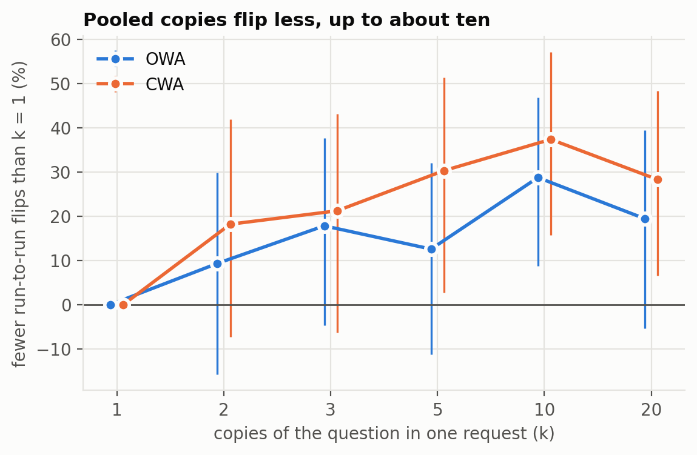

# Decision-Averaging

Does asking a decision model for several classifications of the same item in one request, and pooling them,
make it more accurate or more stable?

Jev (TypeSafe's System One decision model) returns a probability for each option, and one request can carry
several questions about one document. Jev bills input tokens only, and each extra copy of a question adds about
175 of them (the question's text, not the document's). So pooling k classifications in one request is cheap.
This project measures whether it pays.

## Result

**Pooling does not make Jev more accurate. It does make it more repeatable.** Three preregistered studies, about
100,000 requests, $5.50 of Jev. Write-up with figures and every prediction scored:
[`docs/findings.md`](docs/findings.md).

- **Accuracy (studies 1-2):** no pooled arm differs from one classification by more than 1 point, on ProofWriter
  or Emotion, with identical, reordered or reworded copies. Jev's mistakes are made by every copy.
- **Repeatability (study 3):** ten copies in one request cut run-to-run answer flips by about a third
  (OWA 29% [9, 47], CWA 37% [16, 57]) for 3.8× the input tokens. Twenty copies did no better: about half of the
  run-to-run noise is shared by every copy in a request, so averaging cannot remove it.



## Design

- **Study 1** ([`docs/preregistration.md`](docs/preregistration.md)): ProofWriter OWA and CWA, the same 1,800
  items per task as the Hard-Decisions benchmark (`tasks/SOURCE.md`). Arms `jev-k1`, `jev-k3`, `jev-k5`,
  `jev-k10`: one request per item carrying k identical copies of the question. Two runs per arm.
- **Study 2** ([`docs/preregistration-2.md`](docs/preregistration-2.md)): copies made to differ, still one
  request per item, on ProofWriter OWA and Emotion (`dair-ai/emotion` test split, 2,000 items).
  `jev-perm3` rotates the option order; `jev-para3` uses three wordings from `tasks/<task>/variants.yaml`.
- **Study 3** ([`docs/preregistration-3.md`](docs/preregistration-3.md)): does pooling more copies make the
  answer more repeatable? k = 1, 2, 3, 5, 10, 20 identical copies, five fresh runs each (runs 3-7) on 1,000
  items of each ProofWriter task (`tasks/<task>/stability-ids.txt`), scored with Gwet's multi-rater AC1 across the runs (`decision_averaging/stability.py`).
- **Pooling, offline:** `vote` (most slots; ties to the higher mean probability) and `mean` (highest mean
  probability), both scored from the same requests. Every slot's full answer is recorded.
- **Prior work** and what it predicts: [`docs/prior-art.md`](docs/prior-art.md).

## Reproduce

```
make install              # pip install -e '.[dev,jev]'
da replay && da report    # rescore every committed record offline (no key needed), regenerate RESULTS.md
make test
```

`da replay` reproduces `studies/*.jsonl` and `RESULTS.md` byte for byte from `answers/`.

To send new requests you need a TypeSafe key in the environment (`TYPESAFE_API_KEY`) or a gitignored `.env`.
`da answer` is a dry run that prints the price unless `--confirm --max-requests N` is given:

```
da answer 3 proofwriter-owa --run 1                        # price only
da answer 3 proofwriter-owa --run 1 --confirm --max-requests 1800
scripts/run_study2.sh                                       # study 2 arms in the preregistered order (price only)
scripts/run_study3.sh                                       # study 3 runs 3-7 in the preregistered order (price only)
```

Emotion's tweet text is not in this repository (as in the sibling projects); `tasks/emotion/items.jsonl` holds
ids and labels, which is all replay needs. `python scripts/build_emotion.py` (needs `pip install -e '.[emotion]'`)
writes the text to a gitignored `tasks/emotion/texts.jsonl` before answering.

## Run notes

- Study 1 run 1 began with a 20-item `jev-k10` OWA pilot, answered before the `jev-k1` arm and so out of the
  preregistered order. Those rows are kept; the rest of run 1 followed the order.
- Study 1 run 2 was stopped at 1,162 of 1,800 `jev-k10` OWA items and resumed later, so that manifest has more
  than one line.
- Study 2 withdrew a three-separate-requests arm before any arm answered (see its amendment).
- Study 3 was interrupted twice, with no effect on the order or the items. Its first attempt failed on 10
  requests before any answer because no Jev key was available after the harness was vendored (the
  `jev-k2/run3/proofwriter-owa` manifest's first line records 0 answered). Later the account ran out of credits
  partway through run 3's twelfth cell (`jev-k5`, OWA, 329 of 1,000 answered); after credits were added the same
  script resumed where it stopped.
- Before publishing, history was rewritten to remove Emotion text from earlier commits. Run manifests that name
  commit `bd2b213` refer to what is now `112aa87` (same code); `0139dd1` is unchanged. Preregistration 2 was
  frozen in `8b769b8`, before any of its arms answered.

## Layout

```
decision_averaging/          pooled engine and arms, analysis, report, CLI (`da`)
decision_averaging/harness/  task loading, answer runner, records, metrics, AC1: vendored from Hard-Decisions
tasks/                       ProofWriter samples and Emotion ids and labels
answers/<arm>/run<r>/<task>.jsonl.gz   committed records; <task>.runs.jsonl beside each is the run manifest
studies/<task>.jsonl         scored rows; RESULTS.md is generated from them
docs/                        preregistrations, prior art, findings, figures (scripts/figures.py)
```

Model `jev-1.13.0`, recorded per row. Results describe Jev as served on 2026-10-01.
