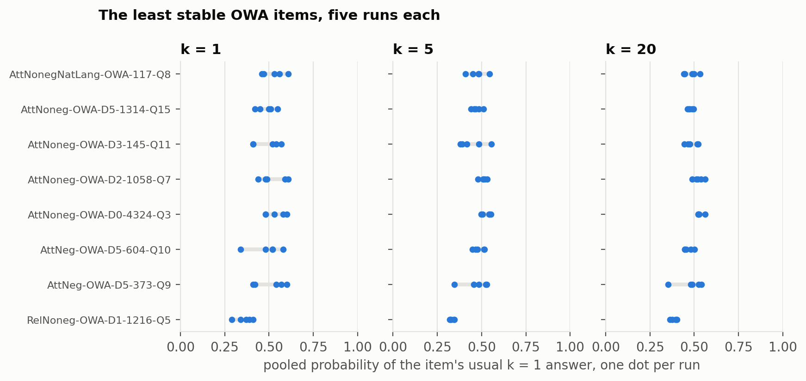
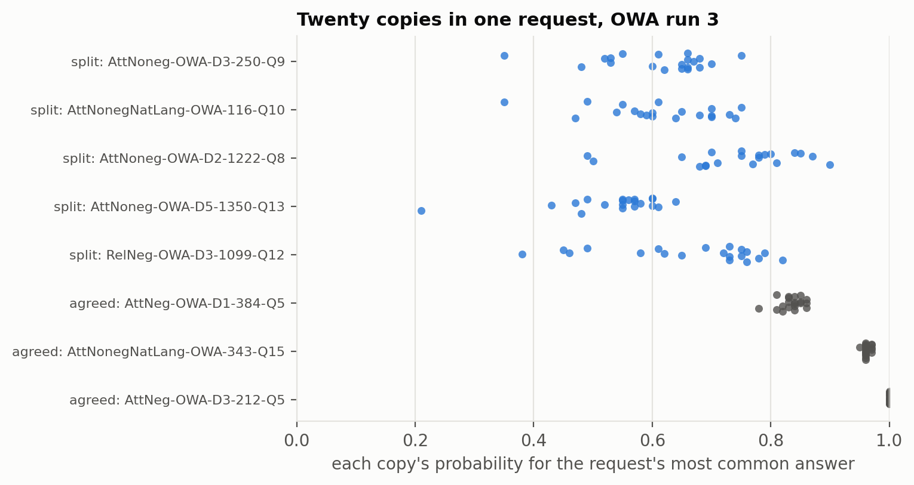
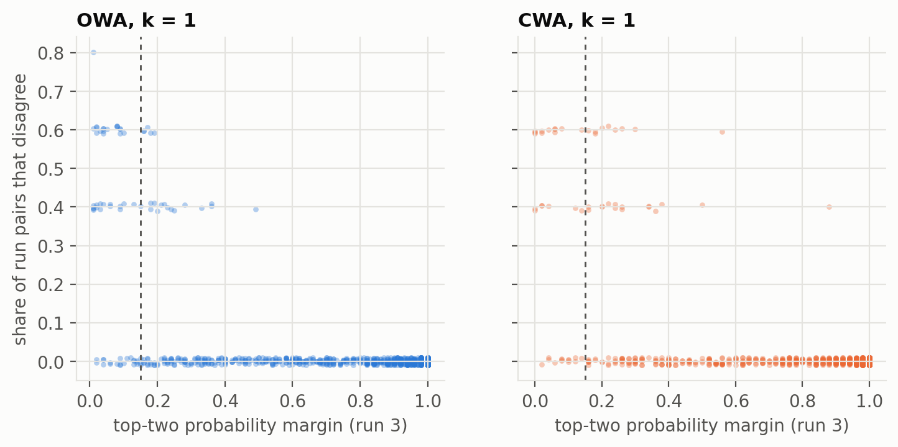
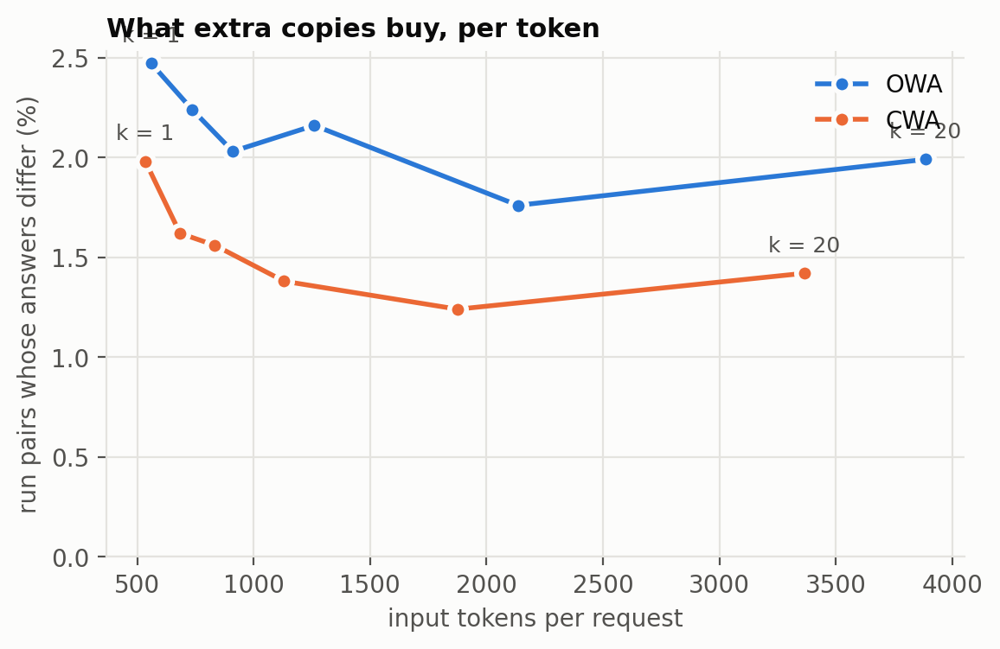

# Findings: pooling several classifications in one Jev request

Draft, 2026-10-01. Numbers come from `RESULTS.md` and `studies/*.jsonl`, which `da replay && da report` regenerate
offline from `answers/`. Figures come from `scripts/figures.py`. Model `jev-1.13.0` throughout. Three
preregistered studies, about 100,000 requests, $5.50 of Jev.

## Answer

**Pooling does not make Jev more accurate. It does make it more repeatable.** Putting k copies of the same
classification in one request and averaging their probabilities left accuracy unchanged on every task, at every
k, and with copies varied by option order or wording (studies 1 and 2). It reduced how often the answer changes
when the same request is sent again (study 3):

| k | cost vs k = 1 | OWA: run pairs that disagree | fewer flips than k = 1 | CWA: run pairs that disagree | fewer flips than k = 1 |
|---|---|---|---|---|---|
| 1 | 1.0× | 2.47% | | 1.98% | |
| 2 | 1.3× | 2.24% | 9% [−16, 30] | 1.62% | 18% [−7, 42] |
| 3 | 1.6× | 2.03% | 18% [−5, 38] | 1.56% | 21% [−6, 43] |
| 5 | 2.2× | 2.16% | 13% [−11, 32] | 1.38% | 30% [3, 51] |
| **10** | **3.8×** | **1.76%** | **29% [9, 47]** | **1.24%** | **37% [16, 57]** |
| 20 | 6.9× | 1.99% | 19% [−5, 39] | 1.42% | 28% [7, 48] |

1,000 items per task, five runs per k, `mean` rule; brackets are paired 95% bootstrap intervals. Ten copies cut
run-to-run flips by about a third on both tasks, and it is the only k whose interval excludes zero on both.
Twenty copies did no better than ten.

Each point's interval reflects how much that rate varies on its own; the comparison with k = 1 in the table is
tighter because it is made item by item.

## Noise, not bias

Kahneman, Sibony and Sunstein (*Noise*, 2021) separate two kinds of judgment error: **bias**, a systematic
deviation, and **noise**, unwanted variability in judgments that should be identical. Asking Jev the same thing
twice and getting two answers is what they call *occasion noise*: the same judge, the same case, a different
moment. Their remedy for noise is to aggregate independent judgments.

Pooling copies is that remedy applied inside one request, and the results split cleanly along their line:

- **It reduces noise.** The pooled probability varies less between runs as k grows (standard deviation 0.017 at
  k = 1, 0.013 at k = 10, 0.012 at k = 20 on OWA), and answers flip less.
- **It does not reduce bias.** Jev's errors are made by every copy: copies disagree on 2–6% of items while 10–41%
  of answers are wrong (studies 1 and 2). On the items that flip, Jev is close to a coin toss, and pooling fixes
  each one on one side, which is still right about half the time. So the same items are wrong, just more
  predictably.

*Noise* argues that reducing noise reduces error. That holds for continuous judgments, where error is bias
squared plus noise squared. For a yes/no decision near its threshold it need not, and here it did not.

Jev is sold as a "System One" decision model, after Kahneman's fast, intuitive System 1 (*Thinking, Fast and
Slow*, 2011). The parallel holds in one more way. Kahneman's advice for aggregating intuitive judgments is to keep
them independent, because judges who share information share errors. Copies inside one Jev request are not
independent.

## Why the benefit levels off

If the k copies were independent, the variance of their average would fall as 1/k, and at k = 20 the run-to-run
spread of the pooled probability would be under a quarter of k = 1's. It fell far less: from 0.017 to 0.0125 on
OWA, and from 0.0144 to 0.0105 on CWA. Splitting the variance into a part shared by every copy in a request and a
part each copy draws on its own:

| | shared by the request | per copy |
|---|---|---|
| OWA | SD 0.012 | SD 0.012 |
| CWA | SD 0.010 | SD 0.010 |

About half of the run-to-run noise belongs to the request and moves every copy together, so no number of copies
can average it away. That is why the curve flattens by about k = 10. The spread between copies inside a request is the
same at every k (0.012–0.014 once corrected for sample size), so the k = 20 dip is not copies getting noisier in
longer requests; its interval overlaps k = 10's, and it is most likely noise around the plateau.

The figure below shows the eight least stable OWA items. Each dot is one run's pooled probability. More copies
pull the five runs closer together, but these items sit at the decision boundary, so even a tight cluster can
straddle it.

Copies inside one request are not identical either. On close calls, twenty copies in one request can range from
about 0.35 to 0.75:

## Where the flips are

Flips concentrate on items whose top two options are close. On OWA, 63% of the items whose k = 1 answer changed
across the five runs had a top-two margin below 0.15; on CWA only 39% did, but nearly all were below about 0.3.
Items with a large margin almost never flip.

## Cost

Jev bills input tokens only. Each extra copy adds the question's tokens but not the document's: 175 per copy on
OWA, 149 on CWA. Latency barely moves (p50 174 ms at k = 1, 181 ms at k = 10, 195 ms at k = 20). Against the cost,
k = 10 buys about a third fewer flips for 3.8× the tokens; k = 3 buys about a fifth fewer for 1.6×, though its
interval includes zero.

## When it is worth it

Pooling is worth considering only when a changed answer costs something in its own right, separately from
whether the answer is right, because it does not change accuracy. That makes it a narrow tool.

**Directly relevant: the same input is classified again, and the first answer cannot be reused.** This is what
the study measured.

- **Reprocessing with new questions added.** Historical records are re-run because a new question was added to
  the request. Jev's answers depend on what else is in the request, so the old labels cannot simply be carried
  over, and every label that changes for no reason is downstream churn: rewritten records, re-sent
  notifications, diffs someone must explain.
- **Independent parties checking the same thing.** A marketplace and a seller each run the same policy check on
  one listing; a router and a compliance service each classify one message. They are separate systems or
  organisations and cannot share answers. Each disagreement is a dispute, a blocked transaction or a manual
  reconciliation.

**Related: inputs are nearly the same, and noise is still costly.** These are plausible but not measured here; the
studies used byte-identical repeats only.

- **Records re-scored as they change.** A ticket's priority or a post's moderation status is re-classified each
  time a comment is added. A spurious flip re-routes the ticket, escalates it or notifies someone.
- **Agents that re-classify each turn.** An agent asks Jev what the user wants at every step, with a growing
  conversation as context. A flip switches tools or plans for no reason.
- **Jev as a judge in evaluations and regression tests.** New prompt or model versions produce slightly different
  outputs to judge. Run-to-run noise creates false regressions or hides real ones, and a lower noise rate helps
  even though no single verdict needs to be right.
- **The same case through different channels.** One complaint arrives by email and again by web form, and each
  copy is classified separately. Inconsistent labels for one case look arbitrary.

In every case pooling reduces flips; it does not eliminate them. About 1.2–1.8% of run pairs still disagree at
k = 10, and the items that still flip are the close calls where the pooled answer is no better supported than
before. Making a wrong answer more repeatable also has a cost: with random errors, a person wrongly turned down
may be treated correctly next time; with repeatable errors, the same people are wrong every time (Creel & Hellman
2022; Cooper et al. 2024).

## Studies 1 and 2: accuracy

| task | one classification | 3 identical | 3 option orders | 3 wordings |
|---|---|---|---|---|
| ProofWriter OWA (1,800) | 84.2% | 84.5% | 84.6% | 84.9% |
| ProofWriter CWA (1,800) | 90.1% | 89.5% | | |
| Emotion (2,000) | 59.2% | 59.0% | 59.1% | 58.9% |

Run 1, `mean` rule. No pooled arm differs from one classification by more than 1 point on any task or run, with
up to ten copies. Even a rule that always picked a right copy when one existed would gain at most 2.6 points
(OWA, paraphrased) and on Emotion 1.4. Varying the copies (rotated options, paraphrased wording) made them
disagree more, up to 2.5 times as often on Emotion, but on items Jev was already unsure of, and accuracy still
moved by less than a point. On Emotion's validation split, Few-Shot-Jev reported +9.9 macro-F1 from labelled
examples in context; pooling gained nothing on the test split here (macro-F1 0.500–0.502 against 0.502). Pooling
cannot supply information Jev lacks.

## Predictions, scored

### Study 1 (`docs/preregistration.md`, identical copies)

1. **True.** `jev-k5` `vote` against `jev-k1`: OWA −0.3 (run 1) and +0.2 (run 2); CWA −0.4 and −0.1. All under
   2 points; every interval includes zero.
2. **True, weakly.** AC1 for `jev-k5` and `jev-k10` exceeds `jev-k1` on both tasks (OWA 0.957 → 0.973 and 0.977;
   CWA 0.959 → 0.964 and 0.972, `vote`). The intervals overlap.
3. **False.** There was no gain to be larger at depth 3–5. `jev-k5` `vote` minus `jev-k1`: OWA −0.2 and 0.0 at
   depth 3–5 against −0.3 and +0.4 at 0–2; CWA −0.9 and −0.1 against +0.1 and −0.1.
4. **True.** `vote` and `mean` differ by at most 0.3 points in every study 1 arm and run.
5. **True.** Two slots in one request disagree on 1.1–1.9% of items; one slot against itself in a separate
   request, 1.8–2.6%. Within a factor of 2 (1.3–1.7 times) in every arm.
6. **True.** Input tokens grow by exactly 175 per extra copy on OWA; p50 latency at k = 10 is within 10 ms of
   k = 1 (178 vs 175, 179 vs 170).

### Study 2 (`docs/preregistration-2.md`, varied copies, one request)

1. **Partly false.** Split-answer share against `jev-k3`: Emotion `jev-perm3` 2.26 times and `jev-para3` 2.45
   times (true); OWA `jev-para3` 2.00 times (true, at the boundary: 100 items against 50); OWA `jev-perm3` 1.58
   times (false).
2. **True.** On OWA, `mean` against `jev-k1`: `jev-perm3` +0.4, `jev-para3` +0.8.
3. **True.** On Emotion, `jev-perm3` −0.1 and `jev-para3` −0.3.
4. *Withdrawn* with the `jev-sep3` arm before any data.
5. **True.** Of the items whose `mean`-pooled answer differs from `jev-k1`, the share with a `jev-k1` top-two
   margin below 0.15: OWA 59% (`jev-perm3`) and 59% (`jev-para3`); Emotion 89% and 67%.
6. **True.** Brier against `jev-k1`: OWA 0.227 and 0.220 vs 0.227; Emotion 0.666 and 0.669 vs 0.667.
7. **True.** Emotion `jev-k1` 59.2% against Few-Shot-Jev's 59.35%.

### Study 3 (`docs/preregistration-3.md`, repeatability by k)

1. **True.** `jev-k10` AC1 minus `jev-k1`: OWA +0.011 [+0.003, +0.019]; CWA +0.015 [+0.005, +0.026].
2. **False on CWA.** OWA: k = 20 0.970 ≥ k = 5 0.968 ≥ k = 1 0.963 (true). CWA: k = 20 0.9716 < k = 5 0.9724.
3. **True.** Gain from k = 10 to 20 against gain from k = 1 to 3: OWA −0.004 against +0.007; CWA −0.004 against
   +0.008.
4. **True.** At k = 20, 40 OWA and 29 CWA items change across the five runs; pair flip rate 81% and 72% of k = 1's.
5. **False on CWA.** Share of items whose `jev-k1` answer changed with a run 3 margin below 0.15: OWA 63% (true),
   CWA 39% (false).
6. **True.** Accuracy, mean over runs: OWA 84.6–85.2% against 85.0% at k = 1; CWA 89.3–89.6% against 89.5%.
7. **True.** Input tokens grow by 175 per copy on OWA and 149 on CWA; p50 latency at k = 20 is 195 ms (OWA) and
   186 ms (CWA) against 174 ms at k = 1.

Reporting choice made after the data: the relative reduction in pair flip rate, with its paired interval, is
reported first, beside the preregistered AC1. It is the same comparison on a more readable scale.

## Deviations from the preregistrations

- Study 1 run 1 began with a 20-item `jev-k10` OWA pilot sent before `jev-k1`.
- Study 1 run 2 was stopped at 1,162 `jev-k10` OWA items, then resumed later in the preregistered order.
- Study 2's `jev-sep3` arm (three requests per item) was withdrawn before any arm answered; it measured a
  different method.
- Study 3 was cut to 1,000 items per task before any run answered. It was interrupted twice (no Jev key after
  the harness was vendored; then the account ran out of credits) and resumed in order each time. One request in
  run 4 failed and was retried before the run moved on.

## Limits

One engine and one model version. ProofWriter is synthetic and templated; Emotion's labels are noisy. All
repeatability runs were made on one day with byte-identical requests, so they describe run-to-run noise, not
drift across model updates or the effect of small input changes. Study 3 used identical copies only.

## References

- Kahneman, D., Sibony, O. & Sunstein, C.R. (2021). *Noise: A Flaw in Human Judgment.* Little, Brown Spark.
- Kahneman, D. (2011). *Thinking, Fast and Slow.* Farrar, Straus and Giroux.
- Creel, K. & Hellman, D. (2022). "The Algorithmic Leviathan: Arbitrariness, Fairness, and Opportunity in
  Algorithmic Decision-Making Systems." *Canadian Journal of Philosophy* 52(1). doi:10.1017/can.2022.3
- Cooper, A.F. et al. (2024). "Arbitrariness and Social Prediction: The Confounding Role of Variance in Fair
  Classification." *AAAI 2024*. arXiv 2301.11562
- Gwet, K.L. (2008). "Computing inter-rater reliability and its variance in the presence of high agreement."
  *British Journal of Mathematical and Statistical Psychology* 61(1):29–48.
- JCGM 200:2012, *International vocabulary of metrology* (VIM), §2.21 repeatability condition.
- Further prior work on ensembles, forecast pooling and prompt variation: `docs/prior-art.md`.
